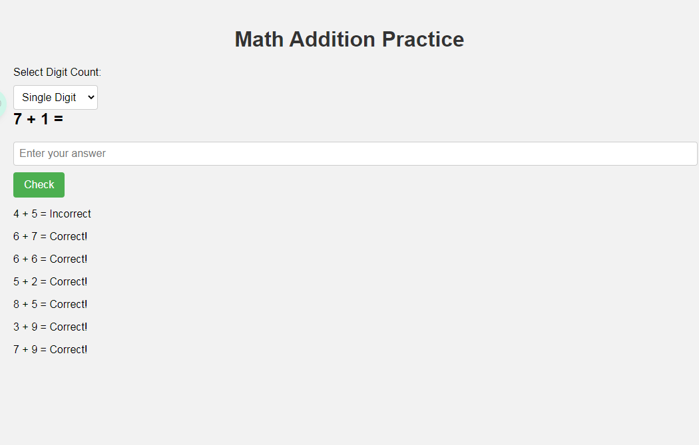
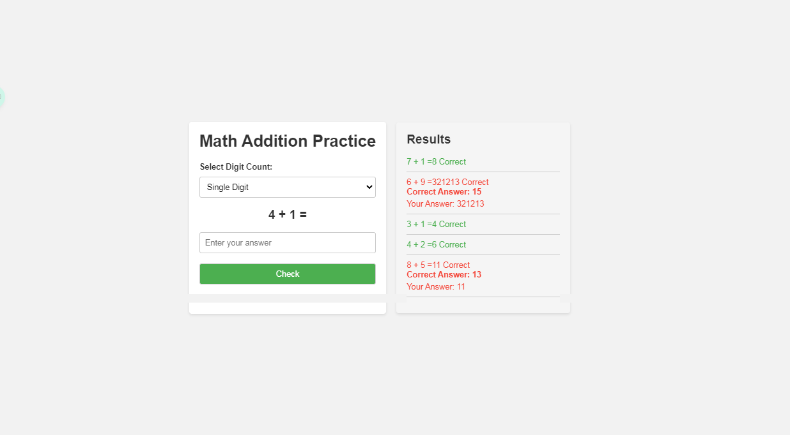

#Mart addition practice for kids.
> built with chatGpt

#### **Reason to make this project:**
> I was trying `chat gpt` to create a basics but usefull webpage.

## Commands
1. make a webpage to practice math addition. user can select digit count to practice addition.
2. make it submit on enter. After submitting show the result in aside. after every submit , equation & result will add on aside stack. 
remove the next button. no need to click on next button. a new addition will appear after every submit 
3. please add some modern webpage style in it
**Result:** 

4. instead of adding the result list in bottom, place this in right side. title the sidebar a Result. add some style on sidebar. add some colours to see some visual difference between correct & incorrect answer. also add my answer and correct answer if not correct

5. Did some personal changes here & there
